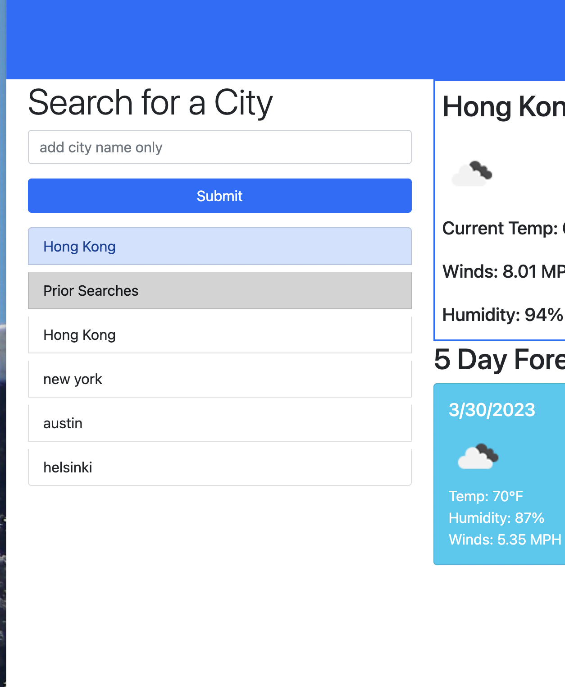

# Weather Dashboard

Provides a quick search of current weather with a five day forecast

## Description

When you open the page you see a search bar to search for weather data around the world. The page loads with current weather for the Houston area.  When you search for a city, the data for your search becomes the active data set and the city is added to a list of previous searches. You can click on the previous searches to re-display the data. If you reload the page, the last search you made repopulates the data set.

## Installation

Navigate to the website:

 [https://phil-pfister.github.io/Weather-Dashboard](https://phil-pfister.github.io/Weather-Dashboard)

 and begin your search.

 ## Screen Shots

 ## Credits

 This site recieves data from the [open weather Api](https://openweathermap.org/api) and from dayjs.  I used the tools that I've learned in Rice university Boot Camp as well as research in MDN, Stack Overflow and Jquery API documentation online. I recieved information additional help during office hours from my instrutor, Brandon Gatlin on click event handlers used on the sidebar. 

[MDN](https://developer.mozilla.org/en-US/)

[Jquery](https://api.jquery.com/)

[Stack Overflow](https://stackoverflow.com/)

## Liscense

MIT
Copyright 2023 Phillip Pfister

Permission is hereby granted, free of charge, to any person obtaining a copy of this software and associated documentation files (the “Software”), to deal in the Software without restriction, including without limitation the rights to use, copy, modify, merge, publish, distribute, sublicense, and/or sell copies of the Software, and to permit persons to whom the Software is furnished to do so, subject to the following conditions:

The above copyright notice and this permission notice shall be included in all copies or substantial portions of the Software.

THE SOFTWARE IS PROVIDED “AS IS”, WITHOUT WARRANTY OF ANY KIND, EXPRESS OR IMPLIED, INCLUDING BUT NOT LIMITED TO THE WARRANTIES OF MERCHANTABILITY, FITNESS FOR A PARTICULAR PURPOSE AND NONINFRINGEMENT. IN NO EVENT SHALL THE AUTHORS OR COPYRIGHT HOLDERS BE LIABLE FOR ANY CLAIM, DAMAGES OR OTHER LIABILITY, WHETHER IN AN ACTION OF CONTRACT, TORT OR OTHERWISE, ARISING FROM, OUT OF OR IN CONNECTION WITH THE SOFTWARE OR THE USE OR OTHER DEALINGS IN THE SOFTWARE.
